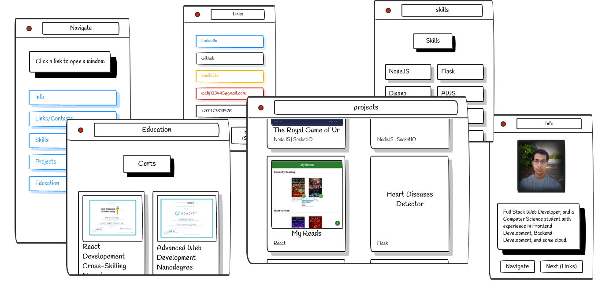

<!--  -->
# Ahmed Haytham

# to start work
1. install npm >= 14
2. run ==> npm i or npm install
3. run ==> npm strart
4. edit in const.js
# Portfolio
[link](https://ahpro7.github.io/Ahmed-Haytham/)

